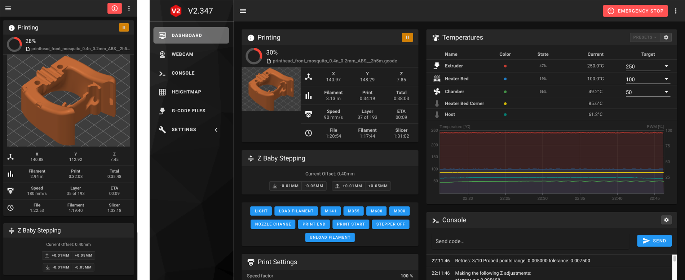

# Mainsail
Mainsail is a lightweight & responsive web interface for the [Klipper](https://github.com/KevinOConnor/klipper)
3D printer firmware. It communicates with the [Moonraker (Klipper-API)](https://github.com/arksine/moonraker) from [Arksine](https://github.com/arksine). 

## Installation

Firstly make sure you've installed the Vanilla Mainsail: [Tutorial](https://docs.mainsail.xyz/setup/). 

#### Install Git first

    $ sudo apt install git

For the ARM V7 Pi's (Pi3 and higher) install Node via:

    $ curl -sL https://deb.nodesource.com/setup_12.x -o nodesource_setup.sh
    $ sudo bash nodesource_setup.sh
    $ sudo apt install nodejs
    
For the older Pi's use:

    $ wget https://nodejs.org/download/release/v11.15.0/node-v11.15.0-linux-armv6l.tar.gz
    $ tar -xvf node-v11.15.0-linux-armv6l.tar.gz
    $ cd node-v11.15.0-linux-armv6l
    $ sudo cp -R * /usr/local/

#### Next, clone this repository:

    $ git clone https://github.com/eliteSchwein/mainsail.git

#### Then install all node Modules:

    $ cd mainsail
    $ npm i
    
#### Then build mainsail

    $ npm build
    
#### Then Copy Your Mainsail files

    $ cp -r dist/* /home/pi/mainsail/

To begin using Mainsail start by [installing](https://meteyou.github.io/mainsail/setup/) it or read the [pages](https://meteyou.github.io/mainsail/) for more informations.

For support join our discord server -> [https://discord.gg/skWTwTD](https://discord.gg/skWTwTD)

## Credit, sources and inspiration
* [Kevin O'Connor](https://github.com/KevinOConnor) for the awesome 3D printer firmware [Klipper](https://github.com/KevinOConnor/klipper)
* [Eric Callahan (arksine)](https://github.com/Arksine) for [Moonraker (Klipper API)](https://github.com/Arksine/moonraker). Without Moonraker, Mainsail would not be possible.
* [lixxbox](https://github.com/lixxbox) for the Mainsail logo & Docs
* [Vue.js](https://vuejs.org/): The Progressive JavaScript Framework
* [Vuetify](https://vuetifyjs.com/): Material Design Component Framework for Vue.js
* [Flaticon](https://www.flaticon.com): for the Logo and Ressource Manager Icons
* [Meteyou](https://github.com/meteyou/mainsail): for the original Mainsail
* [dangire158](https://github.com/dangrie158/hx711-driver): for the hx711 Driver
* [eliteSCHW31N](https://github.com/eliteSchwein/hx711server): for the hx711 Server
* [WallpaperCraft](https://wallpaperscraft.com/): for the main Background

Massive thanks to the whole [Voron Design](http://vorondesign.com/) community. Without them such a project would not be possible.
